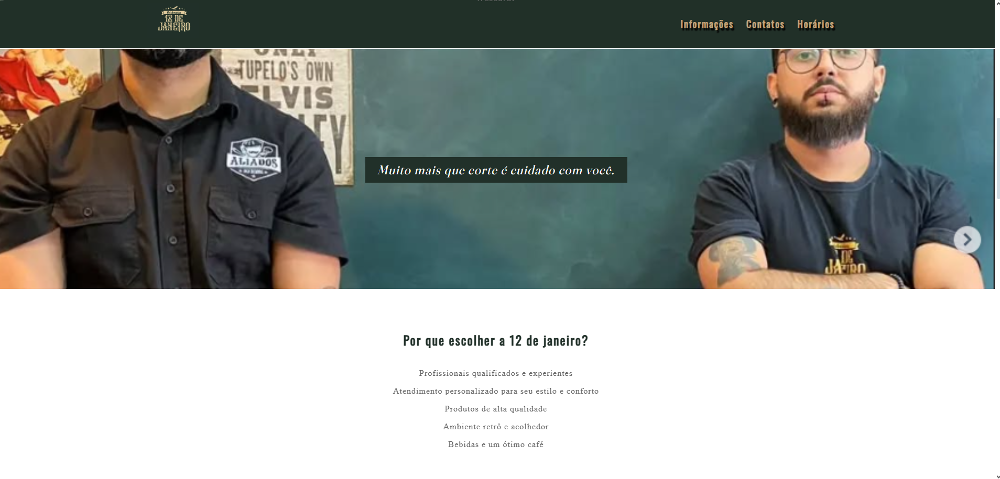

# 💈 Barbearia Estilo Clássico

Projeto de site desenvolvido para uma barbearia fictícia, com foco em um visual moderno e elegante. Construído utilizando apenas **HTML5** e **CSS3**, com layout responsivo e animações suaves para proporcionar uma ótima experiência ao usuário.


---

## ✂️ Funcionalidades

- Página institucional com informações sobre a barbearia
- Seções para serviços, equipe, galeria e contato
- Layout responsivo para celular, tablet e desktop
- Estilização moderna com fontes elegantes e cores clássicas
- Botões com hover e transições suaves

---

## 🛠️ Tecnologias utilizadas

- HTML5
- CSS3
- Google Fonts
- Flexbox e Grid Layout

---

## 🔗 Acesse o site

📍 [Clique aqui para ver o site publicado](https://barber12dejaneiro.vercel.app)  

---

## 📸 Prévia do layout

![layout-desktop]

---

## 👩‍💻 Desenvolvedora

Feito com 💙 por [Mayara Melissa](https://github.com/mmeelissa)  
Entre em contato se quiser um site incrível para o seu negócio!

---

## 📁 Como rodar localmente

```bash
git clone https://github.com/mmeelissa/nome-do-repositorio.git
cd nome-do-repositorio
abra o arquivo index.html no navegador# barber12dejaneiro